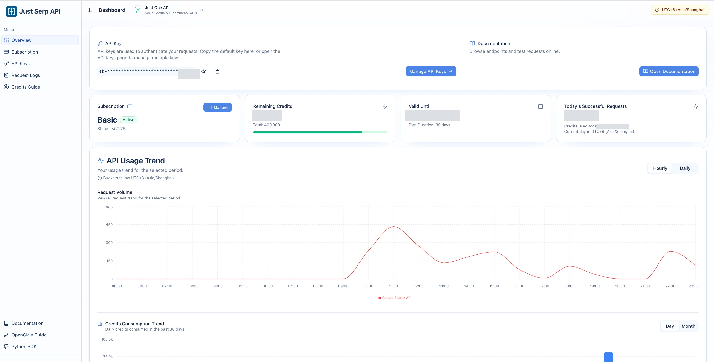

<!-- Generated by JustSerpAPI single-endpoint repository generator. -->

<p align="center">
  <a href="https://justserpapi.com/?utm_source=github.com&utm_medium=referral&utm_campaign=justserpapi_web_markdown&utm_content=repo_readme_logo">
    
  </a>
</p>

<h1 align="center">JustSerpAPI Crawl Webpage Markdown API</h1>

<p align="center">
  <a href="https://pypi.org/project/justserpapi/?utm_source=github.com&utm_medium=referral&utm_campaign=justserpapi_web_markdown&utm_content=repo_readme_pypi_badge">
    
  </a>
  <a href="https://docs.justserpapi.com/api/v1/web/markdown?utm_source=github.com&utm_medium=referral&utm_campaign=justserpapi_web_markdown&utm_content=repo_readme_docs_link">
    
  </a>
  <a href="LICENSE">
    
  </a>
</p>

Crawl a webpage and return clean Markdown content for AI, indexing, and content extraction workflows.

Use this repository as a focused entry point for `/api/v1/web/markdown`. The examples use the official [JustSerpAPI Python SDK](https://pypi.org/project/justserpapi/?utm_source=github.com&utm_medium=referral&utm_campaign=justserpapi_web_markdown&utm_content=repo_readme_pypi_badge) where the endpoint is covered by the SDK, and direct HTTP requests for web crawling endpoints.

## Platform Overview

The documentation center helps you browse endpoint health, versioned API paths, request parameters, and SERP-specific usage notes.

[](https://docs.justserpapi.com/?utm_source=github.com&utm_medium=referral&utm_campaign=justserpapi_web_markdown&utm_content=repo_readme_docs_image)

The console provides API key management, subscription status, credit visibility, request logs, usage trends, and credit consumption analytics.

[](https://dashboard.justserpapi.com/?utm_source=github.com&utm_medium=referral&utm_campaign=justserpapi_web_markdown&utm_content=repo_readme_dashboard_image)

## Installation

```bash
pip install justserpapi
```

## Quick Start

```python
import requests

url = "https://api.justserpapi.com/api/v1/web/markdown"
headers = {"X-API-Key": "YOUR_API_KEY"}
params = {"url": "https://example.com"}

response = requests.get(url, headers=headers, params=params, timeout=30)
response.raise_for_status()
result = response.json()

print(result)
print(result["data"])
```

## API Documentation

- Endpoint: `GET /api/v1/web/markdown`
- Documentation: [Crawl Webpage (Markdown)](https://docs.justserpapi.com/api/v1/web/markdown?utm_source=github.com&utm_medium=referral&utm_campaign=justserpapi_web_markdown&utm_content=repo_readme_docs_link)
- Python SDK: [justserpapi on PyPI](https://pypi.org/project/justserpapi/?utm_source=github.com&utm_medium=referral&utm_campaign=justserpapi_web_markdown&utm_content=repo_readme_pypi_badge)

## Service Overview

The API list below shows the current public JustSerpAPI endpoints. The current repository endpoint is marked with a `Current API` badge.

<!-- API_LIST_START -->

### Google Search API

- [Search API](https://docs.justserpapi.com/api/v1/google/search?utm_source=github.com&utm_medium=referral&utm_campaign=justserpapi_web_markdown&utm_content=repo_readme_api_list)
- [Light Search API](https://docs.justserpapi.com/api/v1/google/search/light?utm_source=github.com&utm_medium=referral&utm_campaign=justserpapi_web_markdown&utm_content=repo_readme_api_list)
- [Mobile Search API](https://docs.justserpapi.com/api/v1/google/search/mobile?utm_source=github.com&utm_medium=referral&utm_campaign=justserpapi_web_markdown&utm_content=repo_readme_api_list)

### Google AI Mode API

- [AI Mode API](https://docs.justserpapi.com/api/v1/google/ai-mode?utm_source=github.com&utm_medium=referral&utm_campaign=justserpapi_web_markdown&utm_content=repo_readme_api_list)

### Google AI Overview API

- [AI Overview API](https://docs.justserpapi.com/api/v1/google/ai-overview?utm_source=github.com&utm_medium=referral&utm_campaign=justserpapi_web_markdown&utm_content=repo_readme_api_list)

### Google Maps API

- [Maps Search API](https://docs.justserpapi.com/api/v1/google/maps/search?utm_source=github.com&utm_medium=referral&utm_campaign=justserpapi_web_markdown&utm_content=repo_readme_api_list)
- [Maps Posts API](https://docs.justserpapi.com/api/v1/google/maps/posts?utm_source=github.com&utm_medium=referral&utm_campaign=justserpapi_web_markdown&utm_content=repo_readme_api_list)
- [Maps Photos API](https://docs.justserpapi.com/api/v1/google/maps/photos?utm_source=github.com&utm_medium=referral&utm_campaign=justserpapi_web_markdown&utm_content=repo_readme_api_list)
- [Maps Reviews API](https://docs.justserpapi.com/api/v1/google/maps/reviews?utm_source=github.com&utm_medium=referral&utm_campaign=justserpapi_web_markdown&utm_content=repo_readme_api_list)
- [Maps Place Details API](https://docs.justserpapi.com/api/v1/google/maps/places?utm_source=github.com&utm_medium=referral&utm_campaign=justserpapi_web_markdown&utm_content=repo_readme_api_list)

### Google Images API

- [Images Search API](https://docs.justserpapi.com/api/v1/google/images/search?utm_source=github.com&utm_medium=referral&utm_campaign=justserpapi_web_markdown&utm_content=repo_readme_api_list)

### Google News API

- [News Search API](https://docs.justserpapi.com/api/v1/google/news/search?utm_source=github.com&utm_medium=referral&utm_campaign=justserpapi_web_markdown&utm_content=repo_readme_api_list)

### Google Videos API

- [Videos Search API](https://docs.justserpapi.com/api/v1/google/videos/search?utm_source=github.com&utm_medium=referral&utm_campaign=justserpapi_web_markdown&utm_content=repo_readme_api_list)

### Google Shorts API

- [Shorts Search API](https://docs.justserpapi.com/api/v1/google/shorts/search?utm_source=github.com&utm_medium=referral&utm_campaign=justserpapi_web_markdown&utm_content=repo_readme_api_list)

### Google Finance API

- [Finance Search API](https://docs.justserpapi.com/api/v1/google/finance/search?utm_source=github.com&utm_medium=referral&utm_campaign=justserpapi_web_markdown&utm_content=repo_readme_api_list)

### Google Trends API

- [Google Trends Search API](https://docs.justserpapi.com/api/v1/google/trends/search?utm_source=github.com&utm_medium=referral&utm_campaign=justserpapi_web_markdown&utm_content=repo_readme_api_list)
- [Google Trends Autocomplete API](https://docs.justserpapi.com/api/v1/google/trends/autocomplete?utm_source=github.com&utm_medium=referral&utm_campaign=justserpapi_web_markdown&utm_content=repo_readme_api_list)
- [Google Trends Trending Now API](https://docs.justserpapi.com/api/v1/google/trends/trending-now?utm_source=github.com&utm_medium=referral&utm_campaign=justserpapi_web_markdown&utm_content=repo_readme_api_list)

### Google Shopping API

- [Shopping Search API](https://docs.justserpapi.com/api/v1/google/shopping/search?utm_source=github.com&utm_medium=referral&utm_campaign=justserpapi_web_markdown&utm_content=repo_readme_api_list)

### Google Immersive Product API

- [Immersive Product API](https://docs.justserpapi.com/api/v1/google/immersive/product?utm_source=github.com&utm_medium=referral&utm_campaign=justserpapi_web_markdown&utm_content=repo_readme_api_list)

### Google Autocomplete API

- [Autocomplete API](https://docs.justserpapi.com/api/v1/google/autocomplete?utm_source=github.com&utm_medium=referral&utm_campaign=justserpapi_web_markdown&utm_content=repo_readme_api_list)

### Google Scholar API

- [Google Scholar Search API](https://docs.justserpapi.com/api/v1/google/scholar/search?utm_source=github.com&utm_medium=referral&utm_campaign=justserpapi_web_markdown&utm_content=repo_readme_api_list)
- [Google Scholar Profiles API](https://docs.justserpapi.com/api/v1/google/scholar/profiles?utm_source=github.com&utm_medium=referral&utm_campaign=justserpapi_web_markdown&utm_content=repo_readme_api_list)
- [Google Scholar Author API](https://docs.justserpapi.com/api/v1/google/scholar/author?utm_source=github.com&utm_medium=referral&utm_campaign=justserpapi_web_markdown&utm_content=repo_readme_api_list)
- [Google Scholar Cite API](https://docs.justserpapi.com/api/v1/google/scholar/cite/search?utm_source=github.com&utm_medium=referral&utm_campaign=justserpapi_web_markdown&utm_content=repo_readme_api_list)

### Google Lens API

- [Lens API](https://docs.justserpapi.com/api/v1/google/lens?utm_source=github.com&utm_medium=referral&utm_campaign=justserpapi_web_markdown&utm_content=repo_readme_api_list)

### Google Jobs API

- [Jobs Search API](https://docs.justserpapi.com/api/v1/google/jobs/search?utm_source=github.com&utm_medium=referral&utm_campaign=justserpapi_web_markdown&utm_content=repo_readme_api_list)

### Google Local API

- [Local Search API](https://docs.justserpapi.com/api/v1/google/local/search?utm_source=github.com&utm_medium=referral&utm_campaign=justserpapi_web_markdown&utm_content=repo_readme_api_list)

### Google Patents API

- [Google Patents Search API](https://docs.justserpapi.com/api/v1/google/patents/search?utm_source=github.com&utm_medium=referral&utm_campaign=justserpapi_web_markdown&utm_content=repo_readme_api_list)
- [Google Patents Details API](https://docs.justserpapi.com/api/v1/google/patents/details?utm_source=github.com&utm_medium=referral&utm_campaign=justserpapi_web_markdown&utm_content=repo_readme_api_list)

### Google Hotels API

- [Hotels Search API](https://docs.justserpapi.com/api/v1/google/hotels/search?utm_source=github.com&utm_medium=referral&utm_campaign=justserpapi_web_markdown&utm_content=repo_readme_api_list)

### Web API

- [Crawl Webpage (HTML)](https://docs.justserpapi.com/api/v1/web/html?utm_source=github.com&utm_medium=referral&utm_campaign=justserpapi_web_markdown&utm_content=repo_readme_api_list)
- [Crawl Webpage (Rendered HTML)](https://docs.justserpapi.com/api/v1/web/rendered-html?utm_source=github.com&utm_medium=referral&utm_campaign=justserpapi_web_markdown&utm_content=repo_readme_api_list)
-  [Crawl Webpage (Markdown)](https://docs.justserpapi.com/api/v1/web/markdown?utm_source=github.com&utm_medium=referral&utm_campaign=justserpapi_web_markdown&utm_content=repo_readme_api_list)

<!-- API_LIST_END -->

## License

Distributed under the MIT License. See `LICENSE` for more information.
